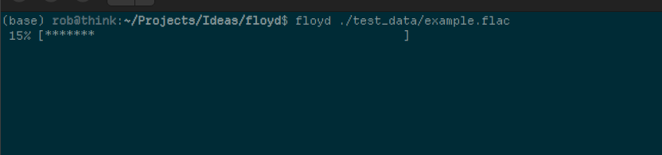

# Floyd CLI

Floyd CLI is a simple command line audio player that plays mp3, flac, and wav files for Linux and MacOS.

If you like floyd_cli, you might like the [GUI based version](https://therohans.com/floyd/).



## Key Bindings

| Key     | Function      |
| ------- | ------------- |
| q       | quit           |
| j       | scrub backwards |
| ;       | scrub forwards |
| s       | stop |
| p       | play |
| r       | rewind |

## Building

It should just be a matte of running

```bash
make build
```

or have a look at the `Makefile` to see how to build.

