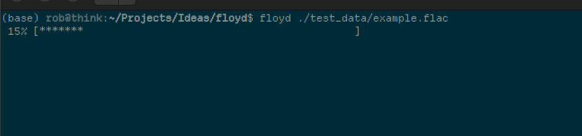
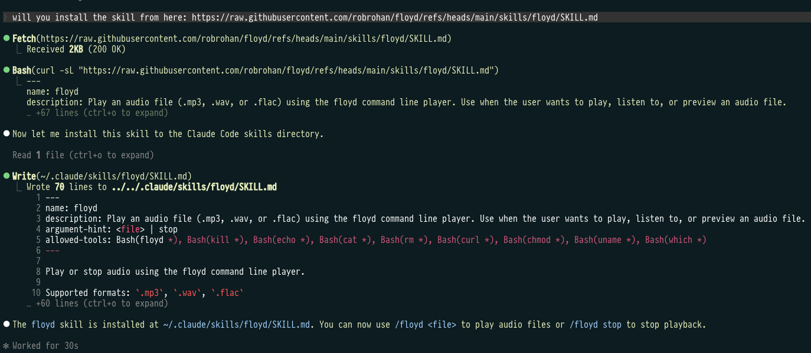
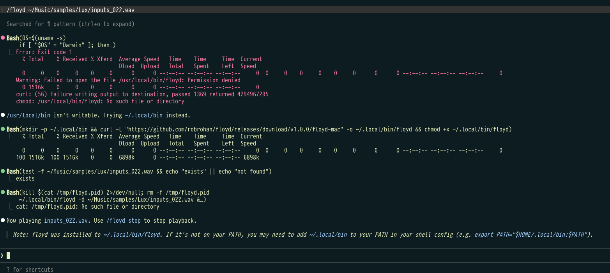
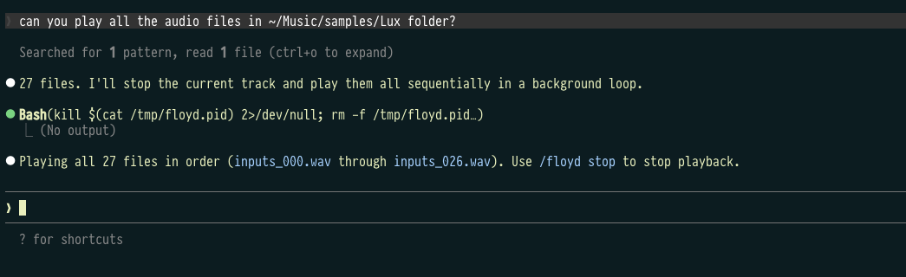

# Floyd CLI

Floyd CLI is a simple command line audio player that can play mp3, flac, and wav files on Linux and macOS (it does not currently work on Windows). It has a simple interface that can be used either on the command line, or via Claude Code using the included skill. See Claude Code section below.

If you like floyd_cli, you might like the [GUI based version](https://therohans.com/floyd/).

## Human Usage of CLI

```
floyd <input.[wav|mp3|flac]>
```



### Key Bindings

| Key     | Function      |
| ------- | ------------- |
| q       | quit           |
| j       | scrub backwards |
| ;       | scrub forwards |
| s       | stop |
| p       | play |
| r       | rewind |

## Claude Code (LLM) Skill

To use floyd with Claude Code you can just ask it to install the skill:

```
will you please install the skill from here: https://raw.githubusercontent.com/robrohan/floyd/refs/heads/main/skills/floyd/SKILL.md
```



Then if you ask it to play some sounds, if you do not have the binary installed it will try to download the binary and put it in your path:



And finally, it can play folders of files in the background if you just ask it to:




## Building

It should just be a matter of running

```bash
make build
```

or have a look at the `Makefile` to see how to build.

